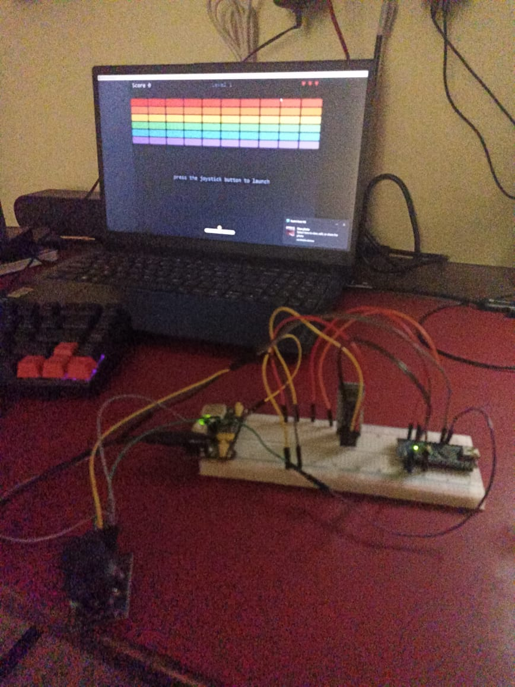
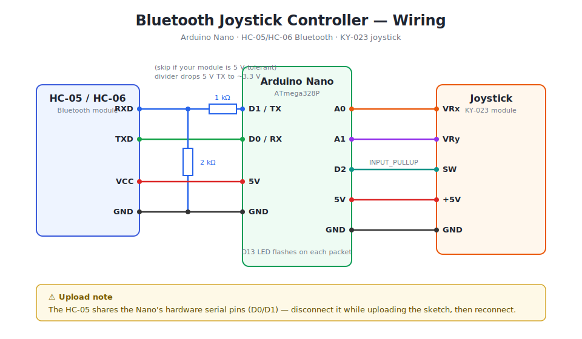

# Bluetooth Breakout 🕹️

A wireless game controller built from an **Arduino Nano**, a **KY-023 joystick**, and an **HC-05 Bluetooth module** — plus a Breakout clone in Python/pygame that you play with it.

The Nano streams the joystick state over Bluetooth as compact 5-byte binary packets (~66 Hz), and the game reads them on the PC with automatic reconnection if the link drops.

## Demo

▶️ **Watch the demo video**

<div style="position: relative; padding-bottom: 56.25%; height: 0;"><iframe id="js_video_iframe" src="https://jumpshare.com/embed/hV9n6O1BKCSac8Y5FGCm" frameborder="0" webkitallowfullscreen mozallowfullscreen allowfullscreen style="position: absolute; top: 0; left: 0; width: 100%; height: 100%;"></iframe></div>

Play Breakout using the custom Bluetooth joystick built with an Arduino Nano and HC-05 module.

<!-- For an inline player instead of a link: edit this README on github.com
     and drag demo.mp4 into the editor — GitHub uploads it and embeds it. -->

## The setup



The breadboard rig: Nano on the right, HC-05 in the middle, joystick on the left — with the game waiting for launch on the laptop.

## Hardware

| Part | Qty |
|---|---|
| Arduino Nano (ATmega328P) | 1 |
| HC-05 or HC-06 Bluetooth module | 1 |
| KY-023 joystick module | 1 |
| 1 kΩ + 2 kΩ resistors (voltage divider for BT RXD) | 1 each |
| Jumper wires / breadboard | — |

### Schematic



| Connection | From | To |
|---|---|---|
| Bluetooth data out | HC-05 TXD | Nano D0 (RX) |
| Bluetooth data in | Nano D1 (TX) | HC-05 RXD *(via 1 kΩ / 2 kΩ divider — the module's RX is 3.3 V logic)* |
| Joystick X axis | VRx | Nano A0 |
| Joystick Y axis | VRy | Nano A1 |
| Joystick button | SW | Nano D2 (`INPUT_PULLUP`, active LOW) |
| Power | VCC / +5V → 5V | GND → GND (both modules) |

> ⚠️ The HC-05 uses the Nano's hardware serial pins (D0/D1). **Disconnect it while uploading the sketch**, then reconnect.

## How it works

The sketch ([component_test.ino](component_test.ino)) samples the joystick every 15 ms and, only when something changed beyond a small deadzone, sends a 5-byte packet at 9600 baud:

```
[0xA5] [x] [y] [button] [checksum]
```

- `x`, `y` — analog readings scaled to 0–255 (centre ≈ 128)
- `button` — 0 or 1
- `checksum` — `x ^ y ^ button`, so the receiver can discard corrupted packets and resynchronise on the `0xA5` sync byte

A binary packet transmits in ~5 ms versus ~15 ms for the old text protocol, which keeps input lag low. The Nano's onboard LED (D13) flashes on every transmission.

## Getting started

**1. Flash the Nano** — open `component_test.ino` in the Arduino IDE and upload (with the HC-05 disconnected from D0/D1).

**2. Pair the HC-05** — Windows: *Settings → Bluetooth & devices → Add device* (default PIN is usually `1234`). Windows creates one or more outgoing COM ports for it.

**3. Install the Python dependencies:**

```sh
pip install pyserial pygame
```

**4. Test the link** (auto-detects the Bluetooth COM port — wiggle the stick while it probes):

```sh
python read_joystick.py
```

**5. Play:**

```sh
python breakout.py            # uses COM9 by default
python breakout.py COM5       # or specify the port
python breakout.py --keyboard # no hardware? arrows + space
```

## Controls

| Input | Action |
|---|---|
| Joystick X axis | Move paddle (analog — further = faster, with a response curve for fine control) |
| Joystick button | Launch ball / next level / restart |
| ← → / Space | Keyboard fallback |
| F11 | Fullscreen |
| Esc | Quit |

## Files

| File | Description |
|---|---|
| [component_test.ino](component_test.ino) | Nano sketch — reads the joystick, transmits packets |
| [breakout.py](breakout.py) | The game, with a background serial reader thread that auto-reconnects |
| [read_joystick.py](read_joystick.py) | Diagnostic tool — finds the right COM port and prints live joystick values |
| [schematic.svg](schematic.svg) | Wiring diagram |
